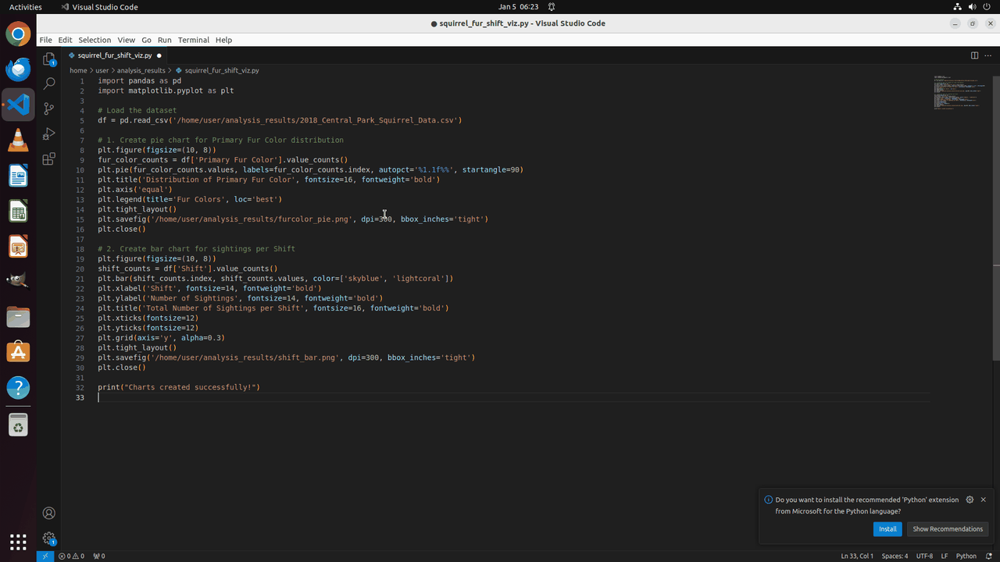

<h1 align="center">DSAgentBench: Can Agents Automate End-to-End Data-Science Workflows in Real Computer Environments?</h1>

<p align="center">
  <strong>Accepted to EMNLP 2026 (main conference).</strong>
</p>

<p align="center">
  <strong>Benchmarking computer-use agents on end-to-end data-science workflows in realistic desktop environments</strong>
</p>

<p align="center">
  <a href="https://arxiv.org/abs/2608.10366">Paper (arXiv)</a> •
  <a href="https://github.com/vis-nlp/DSAgentBench">Repository</a> •
  <a href="evaluation_examples/examples/data_science">Tasks</a> •
  <a href="https://os-world.github.io/">OSWorld</a> •
  <a href="https://github.com/vis-nlp/DSAgentBench/issues">Issues</a>
</p>

<p align="center">
  <a href="https://arxiv.org/abs/2608.10366"></a>
  <a href="LICENSE"></a>
  
  
</p>

<p align="center">
  
  <br>
  <em>Claude 3.5 Sonnet executing task <code>ds018</code>: writing data analysis code in VS Code, resolving terminal dependencies, and generating statistical charts.</em>
</p>

## Table of Contents

- [Overview](#overview)
- [Benchmark at a Glance](#benchmark-at-a-glance)
- [Quick Start (TL;DR)](#quick-start-tldr)
- [Repository Structure](#repository-structure)
- [Installation](#installation)
- [Credentials](#credentials)
- [Desktop Environment](#desktop-environment)
- [Running the Benchmark](#running-the-benchmark)
- [Running a Closed Model (e.g. OpenAI GPT-4o)](#running-a-closed-model-eg-openai-gpt-4o)
- [Running an Open Model (e.g. UI-TARS served via vLLM)](#running-an-open-model-eg-ui-tars-served-via-vllm)
- [Viewing & Analyzing Results](#results)
- [Evaluating Your Own Agent](#evaluating-your-own-agent)
- [Runtime and Reproducibility](#runtime-and-reproducibility)
- [Known Limitations](#known-limitations)
- [Troubleshooting](#troubleshooting)
- [Citation](#citation)

---

## Overview

DSAgentBench extends [OSWorld](https://github.com/xlang-ai/OSWorld) with desktop-based data-science tasks. An agent receives a natural-language request, interacts with an Ubuntu desktop through screenshots and/or accessibility information, works in applications such as VS Code and Jupyter Notebook, and is scored by a task-specific evaluator.

The benchmark covers workflows such as loading and cleaning data, exploratory analysis, visualization, statistical analysis, machine learning, database queries, and producing requested artifacts. Task definitions live in [`evaluation_examples/examples/data_science`](evaluation_examples/examples/data_science), and the default benchmark manifest is [`evaluation_examples/test_all.json`](evaluation_examples/test_all.json).


## Benchmark at a glance

| Component | Repository contents |
| --- | ---: |
| Configured data-science task files | 275 |
| Unique natural-language instructions | 272 |
| VS Code tasks | 224 |
| Jupyter Notebook tasks | 51 |
| Tasks involving Chrome | 6 |
| Dataset download/setup entries | 244 |
| Kaggle downloads | 82 |
| OpenML downloads | 39 |
| HTTPS/GitHub downloads | 123 |
| LLM-assisted evaluators | 39 |

Application counts can overlap. Thirty-one tasks do not preload a dataset and may instead create data locally or retrieve it during execution.

## Quick start (TL;DR)

Get up and running with a single smoke test in 4 steps:

```bash
# 1. Clone and install dependencies
git clone https://github.com/vis-nlp/DSAgentBench.git
cd DSAgentBench
uv sync --locked
uv pip install --python .venv/bin/python openml kaggle

# 2. Configure model credentials
export OPENAI_API_KEY="your-api-key"
export DSAGENTBENCH_MODEL="gpt-4o"

# 3. Create a 1-task test manifest
printf '{"data_science":["ds001"]}\n' > /tmp/dsagentbench-smoke.json

# 4. Run the smoke test with Docker
.venv/bin/python run_data_science.py \
  --provider_name docker \
  --path_to_vm "" \
  --model "$DSAGENTBENCH_MODEL" \
  --observation_type screenshot_a11y_tree \
  --test_config_base_dir evaluation_examples \
  --test_all_meta_path /tmp/dsagentbench-smoke.json \
  --domain data_science \
  --max_steps 10 \
  --result_dir ./results_data_science_smoke
```

## Repository structure

```text
DSAgentBench/
├── desktop_env/                         # OSWorld desktop environment and evaluators
├── evaluation_examples/
│   ├── examples/data_science/           # ds001.json ... ds275.json
│   └── test_all.json                    # Full benchmark manifest
├── mm_agents/                           # Agent interfaces and implementations
├── run_data_science.py                  # Recommended single-environment runner
├── run_data_science_gcp.py              # Experimental machine-specific runner
├── lib_run_single.py                    # Episode execution and artifact recording
├── show_result.py                       # Score summary script
├── pyproject.toml
└── uv.lock
```

## Installation

### Host requirements

- Linux is recommended for the Docker/KVM workflow.
- Python 3.12 or newer is required by [`pyproject.toml`](pyproject.toml).
- Install [`uv`](https://docs.astral.sh/uv/).
- Install Docker and ensure the current user can start containers.
- KVM access through `/dev/kvm` is strongly recommended.
- Reserve at least 40 GB of free disk space for the VM archive, extracted image, Docker layers, and results.
- Allow outbound network access for model APIs, Docker and Hugging Face downloads, Kaggle, OpenML, and task resources.

Check the essential host components:

```bash
python3 --version
uv --version
docker --version
test -e /dev/kvm && echo "KVM is available" || echo "KVM is unavailable"
```

### Clone and install

```bash
git clone https://github.com/vis-nlp/DSAgentBench.git
cd DSAgentBench

uv sync --locked
uv pip install --python .venv/bin/python openml kaggle
```

`openml` and `kaggle` are imported by the environment setup controller but are not currently included in the locked project dependencies. Invoke `.venv/bin/python` directly after installing them; a subsequent `uv sync` may remove undeclared packages.


## Credentials

Configure the API used by the standard `PromptAgent`:

```bash
export OPENAI_API_KEY="your-api-key"
export DSAGENTBENCH_MODEL="gpt-4o"
```

An OpenAI-compatible endpoint can be selected when supported by the chosen model client:

```bash
export OPENAI_BASE_URL="https://your-endpoint.example/v1"
```

The full benchmark includes Kaggle-backed tasks and therefore requires your private Kaggle API credentials:

1. Sign in to Kaggle and open [Settings → API](https://www.kaggle.com/settings/api).
2. Under **Legacy API Credentials**, select **Create Legacy API Key**.
3. Kaggle will download a private credential file named `kaggle.json`.
4. Copy that file into the Kaggle configuration directory used by DSAgentBench:

```bash
install -d -m 700 "$HOME/.kaggle"
install -m 600 /path/to/kaggle.json "$HOME/.kaggle/kaggle.json"
```

DSAgentBench currently reads the exact host path `~/.kaggle/kaggle.json`. Do not place the file directly in `~/.config` or only in `~/.config/kaggle` unless you also update the repository's Kaggle setup code. Treat `kaggle.json` as a password: never commit, upload, or share it.

The tracked [`.kaggle/kaggle.json`](.kaggle/kaggle.json) inside the repository is not used by the downloader and must not contain credentials.

## Desktop environment

### Docker with KVM

Docker is the recommended provider for the data-science benchmark. When `--path_to_vm ""` is supplied, DSAgentBench downloads the OSWorld Ubuntu image from Hugging Face into `./docker_vm_data`.

- VM archive: approximately 12 GB.
- Extracted `Ubuntu.qcow2`: approximately 24 GB.
- Docker image currently used by the provider: `happysixd/osworld-docker:latest`.
- Default VM allocation in the current provider: 4 CPU cores, 4 GB RAM, and a 32 GB virtual disk.

To reuse an existing image, replace the empty argument with an absolute path:

```bash
--path_to_vm /absolute/path/to/Ubuntu.qcow2
```

The VM—not only the host environment—must contain the applications and Python libraries required by the selected tasks. Most tasks use VS Code or Jupyter Notebook; several use Chrome.

<details>
<summary>Common libraries used inside task solutions</summary>

`pandas`, `numpy`, `scikit-learn`, `matplotlib`, `scipy`, `seaborn`, `requests`, `openml`, `beautifulsoup4`, `xgboost`, `plotly`, `yfinance`, `statsmodels`, `shap`, `geopandas`, `imbalanced-learn`, and `transformers`.

</details>

The `--enable_jupyter` and `--enable_vscode` flags are currently no-ops; they do not install or enable software in the VM.

## Quick start

Run one task before committing time and API budget to the complete benchmark.

Create a temporary one-task manifest:

```bash
printf '{"data_science":["ds001"]}\n' > /tmp/dsagentbench-data-science-smoke.json
```

Run the smoke test with Docker:

```bash
.venv/bin/python run_data_science.py \
  --provider_name docker \
  --path_to_vm "" \
  --model "$DSAGENTBENCH_MODEL" \
  --observation_type screenshot_a11y_tree \
  --test_config_base_dir evaluation_examples \
  --test_all_meta_path /tmp/dsagentbench-data-science-smoke.json \
  --domain data_science \
  --max_steps 10 \
  --result_dir ./results_data_science_smoke
```

On the first run, the VM and container downloads can take considerable time. A successful smoke test should:

1. Start the Docker-hosted Ubuntu VM.
2. Download and stage the task input.
3. Open the required desktop application.
4. Let the agent perform actions.
5. Write a numeric score to the task result directory.

Add `--headless` once the visible workflow has been verified.

## Running the benchmark

### Full data-science suite

The default manifest contains all 275 configured entries:

```bash
.venv/bin/python run_data_science.py \
  --provider_name docker \
  --path_to_vm "" \
  --model "$DSAGENTBENCH_MODEL" \
  --observation_type screenshot_a11y_tree \
  --test_config_base_dir evaluation_examples \
  --test_all_meta_path evaluation_examples/test_all.json \
  --domain data_science \
  --max_steps 10 \
  --result_dir ./results_data_science
```

### Selected tasks

Create a JSON manifest containing the task IDs to run:

```json
{
  "data_science": ["ds001", "ds002", "ds003"]
}
```

Then pass its path through `--test_all_meta_path`:

```bash
.venv/bin/python run_data_science.py \
  --provider_name docker \
  --path_to_vm /absolute/path/to/Ubuntu.qcow2 \
  --model "$DSAGENTBENCH_MODEL" \
  --test_all_meta_path /absolute/path/to/my_tasks.json \
  --domain data_science \
  --result_dir ./results_my_agent
```

### Important runtime options

| Argument | Purpose | Current default |
| --- | --- | --- |
| `--provider_name` | VM provider | `vmware` |
| `--path_to_vm` | VM image/configuration path | Machine-specific Windows path |
| `--model` | Model used by `PromptAgent` | `gpt-4o` |
| `--observation_type` | `screenshot`, `a11y_tree`, `screenshot_a11y_tree`, or `som` | `screenshot_a11y_tree` |
| `--action_space` | Agent action representation | `pyautogui` |
| `--max_steps` | Maximum agent turns per task | `10` |
| `--result_dir` | Experiment output root | `./results_data_science` |

Always pass the provider and VM path explicitly; the runner's defaults are not portable.

---

## Running a Closed Model (e.g. OpenAI GPT-4o)

To evaluate a closed commercial model (such as OpenAI GPT-4o), export your API key and invoke the benchmark runner:

```bash
# 1. Set your OpenAI API credentials
export OPENAI_API_KEY="sk-proj-..."
export DSAGENTBENCH_MODEL="gpt-4o"

# 2. Run the evaluation
.venv/bin/python run_data_science.py \
  --provider_name docker \
  --path_to_vm "" \
  --model "$DSAGENTBENCH_MODEL" \
  --observation_type screenshot_a11y_tree \
  --test_config_base_dir evaluation_examples \
  --test_all_meta_path evaluation_examples/test_all.json \
  --domain data_science \
  --max_steps 10 \
  --result_dir ./results_gpt4o
```

---

## Running an Open Model (e.g. UI-TARS served via vLLM)

To evaluate an open-source vision-language UI agent (such as `bytedance-research/UI-TARS-7B-DPO`), host it on your GPU cluster using **vLLM** and expose the OpenAI-compatible endpoint to DSAgentBench.

### Step 1: Serve UI-TARS in Your Cluster

On your GPU cluster instance, launch vLLM to serve UI-TARS:

```bash
vllm serve "bytedance-research/UI-TARS-7B-DPO" \
  --host 0.0.0.0 \
  --port 8000 \
  --dtype bfloat16 \
  --trust-remote-code \
  --api-key "abc123"
```

### Step 2: Configure Endpoint & Run Evaluation

On your evaluation machine, point DSAgentBench to the exposed vLLM endpoint:

```bash
# 1. Point to your cluster's exposed vLLM endpoint
export OPENAI_BASE_URL="http://<CLUSTER_IP>:8000/v1"
export OPENAI_API_KEY="abc123"
export DSAGENTBENCH_MODEL="bytedance-research/UI-TARS-7B-DPO"

# 2. Run the evaluation
.venv/bin/python run_data_science.py \
  --provider_name docker \
  --path_to_vm "" \
  --model "$DSAGENTBENCH_MODEL" \
  --observation_type screenshot_a11y_tree \
  --test_config_base_dir evaluation_examples \
  --test_all_meta_path evaluation_examples/test_all.json \
  --domain data_science \
  --max_steps 10 \
  --result_dir ./results_uitars
```

---

## Evaluating your own agent

The recommended runner currently constructs [`PromptAgent`](mm_agents/agent.py) directly. To evaluate another agent:

1. Implement the same core interface used by the runner:
   - `reset(...)`
   - `predict(instruction, observation)`
   - an `action_space` compatible with `DesktopEnv`
2. Replace or parameterize the agent construction in [`run_data_science.py`](run_data_science.py).
3. Keep the task manifest, VM image, observation type, screen resolution, maximum steps, and evaluator version fixed across comparisons.
4. Start with one deterministic task and inspect its trajectory before scaling up.

See [`mm_agents/README.md`](mm_agents/README.md) for the inherited OSWorld agent interface.

[`run_data_science_gcp.py`](run_data_science_gcp.py) contains experimental branches for OpenAI computer use, Jedi-3B/7B, UI-TARS, and `PromptAgent`. It is not currently a portable drop-in runner: it hard-codes Docker and local filesystem paths, and the local-model clients expect an OpenAI-compatible server on port 8000. Correct those assumptions before using it.

## Results

For each task, the runner creates:

```text
<result_dir>/
└── <action_space>/<observation_type>/<model>/data_science/<task_id>/
    ├── result.txt
    ├── runtime.log
    ├── traj.jsonl
    ├── recording.mp4
    └── step_<n>_<timestamp>.png
```

It also writes:

- `<result_dir>/config_<timestamp>.json` with the requested run configuration.
- `<result_dir>/data_science_summary_<timestamp>.json` with the aggregate and individual scores.
- `logs/data_science-<timestamp>.log` and a corresponding debug log.

Task scores are produced by evaluators defined in [`desktop_env/evaluators/metrics/data_science.py`](desktop_env/evaluators/metrics/data_science.py) and exported through [`desktop_env/evaluators/metrics/__init__.py`](desktop_env/evaluators/metrics/__init__.py).

To quickly inspect and aggregate results across domains and experiments using the provided summary tool:

```bash
.venv/bin/python show_result.py
```


## Troubleshooting

| Symptom | Suggested check |
| --- | --- |
| `ModuleNotFoundError: openml` or `kaggle` | Run the manual `uv pip install` command and use `.venv/bin/python` directly. |
| Docker permission denied | Verify Docker access for the current user. |
| `/dev/kvm` is missing | Enable CPU virtualization and KVM, or use another supported OSWorld provider. |
| Kaggle authentication fails | Verify `~/.kaggle/kaggle.json` exists and has mode `600`. |
| OpenML setup returns an error | Check OpenML availability and retry; these tasks require external service access. |
| Runner tries a Windows VMware path | Pass `--provider_name docker --path_to_vm ""` explicitly. |
| No tasks run | Ensure the manifest contains a `data_science` key and pass `--domain data_science`. |
| VS Code or Jupyter does not open | Confirm the application is installed and usable inside the VM; the enable flags do not install it. |
| `unrecognized arguments: --model_name` | Use `--model` with `run_data_science.py`; `--model_name` belongs to the experimental runner. |

## Citation

If you use DSAgentBench in your research, please cite the DSAgentBench paper:

```bibtex
@article{rahman2026dsagentbench,
  title         = {DSAgentBench: Can Agents Automate End-to-End Data-Science Workflows in Real Computer Environments?},
  author        = {Rahman, Mizanur and others},
  journal       = {arXiv preprint arXiv:2608.10366},
  year          = {2026},
  url           = {https://arxiv.org/abs/2608.10366}
}
```

DSAgentBench is built on OSWorld. Please also cite the original OSWorld paper:

```bibtex
@misc{osworld,
  title         = {OSWorld: Benchmarking Multimodal Agents for Open-Ended Tasks in Real Computer Environments},
  author        = {Tianbao Xie and Danyang Zhang and Jixuan Chen and Xiaochuan Li and Siheng Zhao and Ruisheng Cao and Toh Jing Hua and Zhoujun Cheng and Dongchan Shin and Fangyu Lei and Yitao Liu and Yiheng Xu and Shuyan Zhou and Silvio Savarese and Caiming Xiong and Victor Zhong and Tao Yu},
  year          = {2024},
  eprint        = {2404.07972},
  archivePrefix = {arXiv},
  primaryClass  = {cs.AI}
}
```

